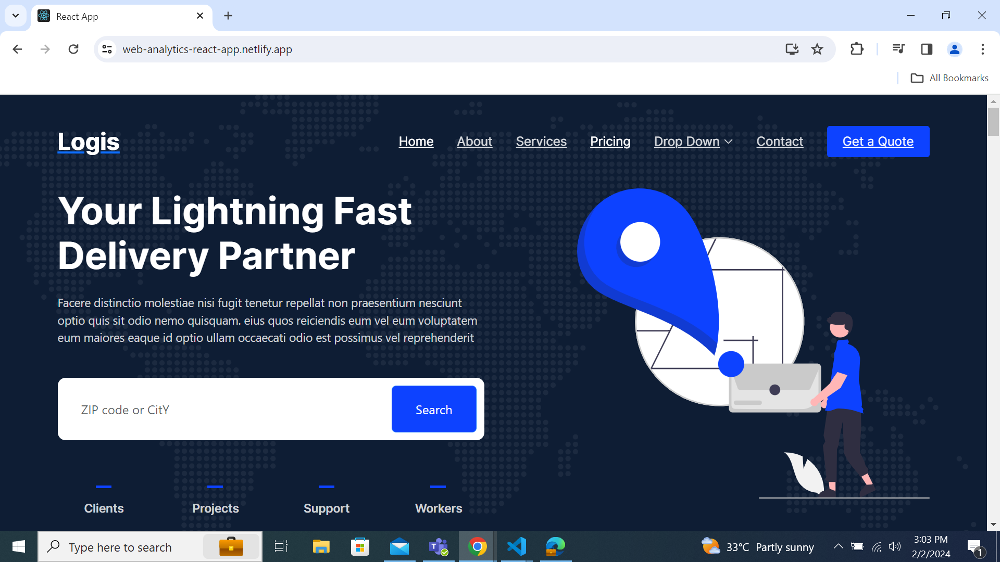

# Web-Analytics

### Application Index Page



## Links

Netlify link-[netlify link](https://web-analytics-react-app.netlify.app/).

Install the dependencies and devDependencies and start the server.

```sh
cd dillinger
npm i
node app
```

## Plugins

| Plugin           | README                                    |
| ---------------- | ----------------------------------------- |
| Dropbox          | [plugins/dropbox/README.md][PlDb]         |
| GitHub           | [plugins/github/README.md][PlGh]          |
| Google Drive     | [plugins/googledrive/README.md][PlGd]     |
| OneDrive         | [plugins/onedrive/README.md][PlOd]        |
| Medium           | [plugins/medium/README.md][PlMe]          |
| Google Analytics | [plugins/googleanalytics/README.md][PlGa] |
